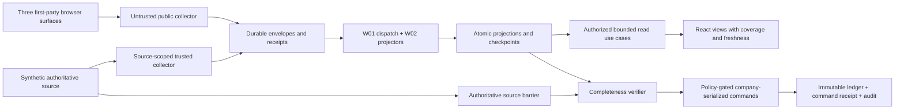

# Automaktab Analytics: Architecture and Product Specification

Status: **written specification approved 5 October 2026; execution-plan approval pending**. Prepared 5 October 2026. This is the next architectural decision artifact, not implementation authorization. Written spec and DS approval permits preparation of the [bounded execution plan](../implementation-execution-plan.md). Obtain plan/execution approval before scaffolding, installing, or writing product code.

## Goal and authority

Build an independently hosted internal founder/team tool for acquisition, traffic, usage, official learning, school structure and manual platform-subscription bookkeeping. Collect first-party events from `automaktab.uz`, `app.automaktab.uz`, and `student.automaktab.uz`; no external analytics SaaS is a core dependency. These surface names are confirmed scope, not authorization to install trackers or change their repositories. Practice remains separately segmented and its rollout is undecided.

The latest user direction is dark deep-gray/slate with tech-blue accents, accessible and suitable for a professional developer handoff. It supersedes the earlier light direction. DM Sans remains the proposed interface font from the existing specification; assets and exact tokens require approval and license verification. Markdown is English; final product language remains an explicit decision.

Binding existing references: [architecture](../architecture.md), [API contracts](../api-contracts.md), [UI acceptance](../ui-ux-requirements.md), [M0–M8 milestones](../implementation-plan.md), [G01–G14 decisions](../review-gates.md), and [role isolation](../agent-skill-map.md). They retain their domain/security/acceptance invariants. This spec adds current scope, design and runtime constraints rather than reproducing every API field.

## Observed baseline and stage

Local inspection: `main` at `0a5077d2c78c633e23a1c430987d9b6cd2e73cc6`; eight tracked Markdown files, no application sources, manifests, lockfiles, tests, migrations, CI or runtime configuration. At initial inspection no locally approved written spec/implementation plan or approval record was found; subsequent user approval on 5 October covers this written spec and DS, while execution-plan approval remains pending. The earlier attempted `implementation-execution-plan.md` is absent. Existing milestone text and checked document-review findings are not execution approval.

Historical transfer inspection recorded seven untracked files under `.plan-inputs-20261003/`: the ZIP and six Markdown files. ZIP SHA-256 is `c31b33c3dd0619c9459cf59ca9bb210c8cc4e7dd90be45e5b077b559e9ceceb2`, matching the supplied transfer contract at that inspection. The package's five reviewed document digests matched its review manifest then. Final inspection in the current selected executor finds this directory absent; current preservation and package availability cannot be reverified. No deletion was performed by this documentation task. Restore the authorized inputs and verify their recorded hashes before relying on their cards in an execution plan. Its analytics cards are useful planning inputs; its separate Autodrive repair track is outside this task and was not inspected for implementation.

Historical package paths (currently unavailable): `.plan-inputs-20261003/Automaktab-Implementation-Task-Package-2026-10-03/` containing README, BACKEND-DATA-BILLING-TASKS, UI-UX-FRONTEND-TASKS, TEAM-EXECUTION-AND-GATES and ADVERSARIAL-REVIEW Markdown files. Their historical light-theme instruction is superseded by this spec and DS00–DS05. Do not reinterpret a historical package review as approval of this revision.

The package has 51 analytics capability/task cards, not 51 agents. Its resolved issues remain invariants: verified links precede analytics consumers; W01/W02 own the actual worker pipeline; an UNKNOWN financial command blocks replacement submission; component acceptance is distinct from paired product acceptance; verification QA and black-box Tester remain separate. The missing 30-task draft is not reconstructed as a competing execution plan. The approved spec will guide reconciliation into one bounded plan later.

## Options and selected design

Recommended: one modular NestJS application with a separate worker process sharing reviewed domain/application modules and a dedicated PostgreSQL database. It keeps deployment and transactions understandable while allowing the worker to restart independently. A process-local background loop is simpler but couples durable dispatch to HTTP uptime; distributed services add contracts and operational failure modes without an established need. Do not adopt either alternative silently.

Use React + Vite, current supported NestJS, Drizzle, PostgreSQL, pnpm and latest stable compatible TypeScript. Exact versions, module format, decorator metadata and compiler-tool API compatibility are unverified. Resolve and prove the whole toolchain in M1 using version-matched official sources/Context7. Do not quietly downgrade TypeScript or use prerelease Drizzle tooling because a getting-started example uses it.

Local application runtime is **Docker only**. Future web development, API, worker, database, test runners and migration exercises run inside approved local containers; the host is for editor, Git and Docker orchestration. No host pnpm/Node app-runtime workflow is implied. No Docker image or Compose file is created by this document. P01 must inspect container commands, engines, locks, mounts, exposed ports and lifecycle effects before they become allowlisted executable commands.

DigitalOcean is the CI/CD deployment target. Proposed architecture uses reproducible container images built/tested in CI and a separately approved deployment stage. Exact CI provider, Droplet/App Platform choice, database hosting, registry, regions, TLS/secrets, backup RPO/RTO and costs remain operational decisions. No cloud resource, workflow, credential, push-triggered deployment or live migration is activated now. An initial synthetic local slice does not depend on these production choices.

### Foundation setup and compatibility register

Setup is requested, but execution follows written-spec review and bounded plan approval. This register records official observations on 5 October 2026, not an installed or tested matrix. Registry access from the shell failed DNS resolution; browser-accessible official metadata supplied the observations below. Context7 is not available in the current callable tools.

| Component | Official observation / proposed candidate | Compatibility proof still required |
| --- | --- | --- |
| Node | [24.21.0 latest LTS](https://nodejs.org/en/download); 26.10.0 is Current | Pin container image digest and architecture; test all tools in it |
| pnpm | [12.9.1 latest](https://registry.npmjs.org/pnpm/latest), Node >=18 | Exact packageManager pin, lifecycle allowlist and frozen-lockfile reproduction |
| TypeScript | [7.0.2 latest](https://registry.npmjs.org/typescript/latest), Node >=16.20 | Nest decorator metadata, compiler API consumers and Drizzle generation; do not silently downgrade |
| React | [19.3.0 latest](https://registry.npmjs.org/react/latest) | [react-dom 19.3.0 metadata](https://raw.githubusercontent.com/facebook/react/v19.3.0/packages/react-dom/package.json) matches React; resolve types and compatible Vite plugin peers |
| NestJS | [core 12.1.2](https://www.npmjs.com/package/%40nestjs/core?activeTab=versions) | [CLI 12.0.8 metadata](https://raw.githubusercontent.com/nestjs/nest-cli/12.0.8/package.json) uses TypeScript ~6.0.2; independently resolve matching common/platform packages; [official guide](https://docs.nestjs.com/migration-guide) requires Node 24.15+ for generation and currently upgrades TypeScript to v6, so v7 compatibility is unresolved |
| Vite / plugin-react | [Vite 8.3.2 release metadata](https://raw.githubusercontent.com/vitejs/vite/v8.3.2/packages/vite/package.json); plugin-react unresolved | Confirm latest stable registry tags, Node engines and plugin peers before exact selection |
| Drizzle ORM / Kit / pg | [ORM 0.45.3 metadata](https://raw.githubusercontent.com/drizzle-team/drizzle-orm/0.45.3/drizzle-orm/package.json), [Kit 0.31.11 metadata](https://raw.githubusercontent.com/drizzle-team/drizzle-orm/0.45.3/drizzle-kit/package.json); pg unresolved | Confirm stable tags separately from 1.0 prereleases; TypeScript 7 and PostgreSQL driver/generation proof |
| PostgreSQL | [18.6 supported release](https://www.postgresql.org/support/versioning/); proposed postgres:18.6-bookworm | Verify official image tag/digest and architecture; migration/transaction/integration proof; [DO managed PG18](https://docs.digitalocean.com/products/databases/postgresql/how-to/create/) minor is provider-selected |

Additional official release metadata was supplied by the coordinating research context on 5 October. Nest release-page evidence reported 12.1.1, while the registry observation above reported core 12.1.2: re-resolve authoritative tags for every aligned package before locking. TypeScript 6.0.3 is only a proposed conservative alternative from that research, not an approved downgrade or selected pin. If TypeScript 7 cannot pass the required container proofs, present the concrete incompatibility and obtain a documented version decision before changing the requirement. No exact lockfile or tested setup exists.

The first bootstrap's proposed owned paths are root `package.json`, `pnpm-workspace.yaml`, `pnpm-lock.yaml`, `.npmrc`, TypeScript base configuration, Dockerfile/Compose files, `apps/web`, `apps/api`, resolved worker entry, `packages/contracts`, and `packages/tracker`. Integrator owns shared files; Contracts Writer and Migration Writer receive explicit transfers. No parent/sibling configuration changes. Bootstrap creates only synthetic foundation and health/read boundaries; no live tracker/auth/billing activation or cloud deployment. Exact scripts and container commands are authored and inspected in P01, then independently allowlisted before QA executes them. Required proof includes clean container install with frozen lock, workspace lint/types/tests/build, Nest metadata startup, Drizzle generation and fresh/upgrade database exercises. Failure pauses bootstrap integration; report incompatibility instead of forcing peer resolution or replacing the chosen stack.

## Module and dependency boundaries

The planned workspace retains `apps/web`, `apps/api`, `packages/contracts` and `packages/tracker`. Resolve one outstanding path choice before P01: W01/W02 package cards propose `apps/worker`, while the original architecture permits a worker entry in `apps/api`. Recommended: `apps/worker` as a thin separate process entry using explicitly exported API application ports; it remains the same modular application, not a network microservice. One owner maps all paths and updates the contract register before coding. No duplicate worker implementations.

| Module | Owns | Boundary |
| --- | --- | --- |
| Auth | Dedicated analytics sessions, explicit grants and provider adapter | No inherited school/developer access; synthetic identity barred from production |
| Collection | Privacy validation, durable admission receipts/inbox | Public and trusted routes have independent schemas/guards; browser cannot elevate trust |
| Identity/schools | Verified links, school/branch models, canonical subjects, effective aliases | Company.id is school identity; phone/name matching is never proof |
| Traffic/usage/acquisition/funnels | Versioned metrics and bounded projections | Browser observations do not become official outcomes or financial facts |
| Learning | Trusted official results, separate practice | Browser completion is not official learning evidence |
| Billing | Draft contracts/policies, immutable invoices, receipt ledger/corrections | Platform fees separate from school tuition; no money movement |
| Reminders/audit | In-app attention, append-only provenance | No suspension, login blocking or unapproved external messages |
| Worker | Durable acquisition/dispatch and projector registration | Leaf projectors consume the supplied transaction; no hidden direct DB writes |

Controllers validate transport and call named use cases. Pure calculations import no NestJS, HTTP or Drizzle. Persistence adapters receive the application's transaction handle; global-connection fallback is forbidden. Apply SOLID to actual change boundaries: explicit small ports for auth, clock, transactions and persistence, not a generic interface for every helper. Module exports and transport schemas are reviewed; frontend imports only `packages/contracts`, never ORM/server models.

## Contracts, identity and privacy

Freeze one scoped contract revision before parallel consumers: validated event envelopes, receipt/status errors, safe session metadata, school/branch/opaque-subject filters and deterministic cursor pagination, coverage/freshness, source blockers and quality/availability. Existing route families are `/collect/v1`, `/internal/v1`, `/api/v1`; the session routing prefix discrepancy must be resolved in C01 rather than guessed by the frontend.

Unknown values need explicit nullability/availability. Proposed metric value is `{ value: string | null, unit, definitionVersion, availability: known | unknown | notApplicable }`; composite quality includes oldest contributing `dataThrough`, coverage, checkpoints and warnings. Known zero is distinct from unknown. Query execution time is not source freshness. Money remains decimal integer minor-unit strings with currency and server-confirmed scale; never native bigint JSON, floating-point money or unlabeled mixed-currency totals.

Untrusted telemetry cannot establish company ownership, verified identity, lifecycle, learning results or payments. Strip contact/form data, route IDs, query/hash/credentials before storage. Distinct anonymous, source student, verified learner link and school-scoped billing-subject identities must not be conflated. BE-004 owns verified links and their proof/revocation/replay, then BE-007 consumes them, then BE-008 consumes both. No BE-007↔BE-008 cycle.

Trusted aggregate n+1 waits for n and required parents; identical duplicates replay harmlessly, conflicting content/unknown versions are quarantined. Projection and checkpoint commit atomically. Producer source/environment authentication, a consistent source snapshot/barrier, aggregate heads, tombstones, cutover/as-of/hash and all dependencies are necessary for completeness. A gap-free local inbox/outbox maximum is insufficient. No historical active days are invented before cutover. Operational source mutation/outbox atomicity needs a separately scoped source-repository task.

Privacy store inventory covers browser queue, visitors/links/aliases, attribution, inbox/quarantine, rollups, logs, command receipts, audit, finance, exports and backups. Purpose/access/consent/retention/deletion rules remain decisions before live tracking or irreversible expiry. Bounded queues, requests, retries, pools, pagination and streams are required; concrete limits are frozen in C01/P01 and verified against synthetic overload. Opaque identifiers remain protected data.

## Roadmap and reference interpretation

The agreed advanced roadmap is retained: overview/acquisition/traffic/pages, event trends and versioned goals/funnels/journey context, usage, official learning/practice segmentation, live activity, school/branch/subject views, full manual platform-billing review/recovery, reminders and diagnostics/audit. Read the [source-labeled DataFast study](../reference.md). The proposed first read-only slice is delivery phasing, not approval to delete later features. Cohort retention, multitouch/prediction, replay or external social/ads features require their own explicit definition/scope where not already approved; new/returning visitor terminology alone does not specify retention.

## Core journeys and product acceptance

| Journey | Observable outcome | Required dependencies/evidence |
| --- | --- | --- |
| Synthetic protected school list → detail → source status | Understand school/branch/subject structure and missing coverage without guessed money | BE-002–006, C01.read, W01/W02.source, FE-01–03, initial FE-09/15; UX-B01–03/B08 |
| Traffic/acquisition/usage/learning analysis | Understand period, surface, units, definition and oldest-input freshness | Reviewed metric definitions, verified links/trusted results; UX-B02/03/B08 and UX-U01 |
| Contract → nonposting preview → immutable close | Review basis, source/policy blockers and confirmed result | G04–09/G13, exact policy fixtures, concurrent PostgreSQL proofs; UX-B04 |
| Receipt → allocations/credit → reviewed reversal | Record received cash once and understand balance consequences | Actor-bound intent recovery, company ledger guard, previews/revisions; UX-B05, UX-U02/03 |
| Overdue → receipt or acknowledgment | See numeric business-local overdue days; seen does not mean paid | Approved due convention, positive eligible balance, dedup/reversal behavior; UX-B06 |

Every affected screen covers loading, empty/no matches, known zero, unknown/unavailable, stale/partial, error/offline/rate limit, denied/expired session, sample label, duplicate actions, refresh, Back/Forward, narrow layout and keyboard. Live adds bounded snapshot/SSE, replay dedup, reconnect/reset and expiry; UX-B07. Reusable components and states are specified by [DS00](../design/DS00-overview.md) through DS05. These documents make no rendered-screen or conformance claim.

Mandatory acceptance uses existing A11Y-01–10, UX-R01 and relevant UX-B IDs, actual synthetic screenshots and the agreed browser/AT matrix. Test 320-pixel reflow, 200% text resize and 360/768/1280/1440 widths. Required unverified rows block product delivery. Participant UX-U01–03 require authorized actual founder/team participants; agents and scans cannot replace them. Numeric UI/API/load budgets remain proposed until approved with hardware/data/workload assumptions; design scale targets are not benchmark results.

## Financial invariants and unresolved policy

Manual per-school agreements support fixed monthly, fixed annual and monthly per-active-student categories. School totals, branch attribution and subject basis reconcile. Fixed-fee breakdowns are management allocations, not extra invoices. Completed, dropped, archived/deleted and demo students are excluded; suspension, same-day status/transfer, proration denominator and rounding remain undecided. Activity telemetry never determines billable activity.

G05–07/G13 must record currency/scale, business timezone, school price/effective dates, stable period/annual anchor, active eligibility, rounding/residuals, rate revisions/cancellation/overlap, due convention, activation actors and correction behavior. Unknown policy blocks dependent calculations/commands. Labeled hypothetical fixtures can compare alternatives but cannot become fallback live policy. Invoice corrections preserve originals; receipt reversal neither changes original billed amount nor refunds money.

Financial business uniqueness, transactional idempotency, company serialization and immutable DB protections supplement one another. Commit business record, original command receipt, audit and local outbox together. Reauthorize every retry; exact committed replay returns the original result, even if the successful operation advanced ledger revision. Changed body conflicts. Stale close/reversal/allocation requires a new review; no automatic adjustment to consequences.

**UNKNOWN guard:** response loss/navigation cancellation/session expiry cannot establish non-commit. Retain/reconcile the original actor-bound intent/key/body under an approved minimal-data recovery contract. While UNKNOWN/in progress, block replacement submission even after amount/allocation edits. Only authoritative committed or definitely-not-committed resolution allows a deliberate subsequent action. No financial offline queue or automatic resubmit after login. Logout clears protected client data without losing the server's auditable original command. C01/FE-16 must specify discovery/status, lifetime, permissions and safe abandonment before financial UI work.

## Ownership, reviews and operational recovery

Lead coordinates scope/dependencies; Integrator alone writes workspace manifests/lockfile/shared startup; Contracts Writer owns schemas/registry; Migration Writer owns schema ordering; UX owns the DS specification and later one token/asset manifest; FE-01 implements primitives/tokens; FE-02 owns routes/session/filter wiring; FE-03 owns read adapters; FE-16 owns financial intents. Feature writers request shared edits, not patch concurrently. W01 owns dispatch/acquisition; W02 variants exclusively serialize registry and projector wiring. API projector owners retain their modules. Document exact path-lock transfer from startup skeleton to Worker Implementer.

Each implementation task and final combined candidate gets two fresh independent inspection-only R1/R2 reviews against the same candidate/evidence key; neither writes files nor executes project/package code. Their first findings remain isolated. Separate non-author verification-only QA runs a reviewed command allowlist. Tester uses black-box browser interactions, no scripts/config/fixture edits, independently checks synthetic outbound sinks before consequential actions. Adviser cannot waive failed evidence or policy.

A backend component may become COMPONENT_INTEGRATION_READY after its required API/DB evidence and reviews. Paired UI tests remain NOT RUN until the named combined stage, avoiding a circular dependency on a not-yet-integrated frontend. School-slice delivery requires W01/W02.source→real API→FE-09/15 plus combined verification, both current reviews and exact-candidate Tester PASS. Any candidate/review-key change invalidates both approvals and requires corresponding verification/Tester reassessment.

Later operations: nonproduction fresh/upgrade migrations, forward-compatible schema→consumer→producer→frontend order, bounded restart/replay, readiness during DB loss, restore with dedup/audit/ledger invariants, and approved load measurement. Rollback pauses unsafe closes and preserves accepted events/immutable financial records. No destructive financial down-migration. CI/deployment/source integration/live billing/privacy activation/outbound delivery retain separate approval and exact-environment evidence.

## Sources and evidence limitations

The user references [DataFast demo](https://datafa.st/demo). Text retrieval on 5 October returned its title but no readable body; no local rendered demo was inspected. Layout comparisons are inspiration/proposals until actual source observations are recorded. Original composition, no proprietary source/branding/assets, and no external analytics runtime dependency are required.

Engineering-team handbook guidance was consulted as planning input. Handbook controls are documentation, not verified runtime enforcement. The public-safe self-contained role rules in this repository govern the handoff; current implementation approval remains absent.

Technical references: [Nest migration guide](https://docs.nestjs.com/migration-guide), [Drizzle transactions](https://orm.drizzle.team/docs/transactions), [PostgreSQL isolation](https://www.postgresql.org/docs/current/transaction-iso.html), [WCAG 2.2](https://www.w3.org/TR/WCAG22/), [text contrast](https://www.w3.org/WAI/WCAG22/Understanding/contrast-minimum.html), [DM Sans](https://fonts.google.com/specimen/DM+Sans). Version-matched toolchain and asset licenses are verified in their later owning tasks; links alone do not establish compatibility or conformance.

## Review and next bounded milestone

Read [document review](2026-10-05-document-review.md) for the exact inspected file manifest, findings, fixes and scope. Document review is not product QA/R1/R2/Tester PASS. No actual UI, package, PostgreSQL, browser/AT, participant, CI or deployment checks have run.

Recommended first executable milestone **after written-spec approval and bounded plan/execution approval**: Docker-only synthetic protected school list/detail/source-status slice. Establish toolchain/API/web/database/worker first, freeze only read contracts, prove durable admission→worker→projection→query→UI, then actual independent evidence. Keep financial operations, real identity/tracker/source integrations and production deployment disabled. Proposed runtime paths/commands are mapped and inspected by P01 before execution; none are runnable commands now.

### Decisions for the next gate

1. Written spec and DS00–DS05 are approved for plan preparation. Approve the separate execution plan and select its bounded first batch before setup; recommended T00–T02 foundation, then synthetic school/source-status slice.
2. Product UI language? Recommended: Uzbek Latin first, externalized strings and locale-aware dates/numbers; English remains documentation language.
3. Before financial work, who confirms active-student and policy examples? Recommended: product owner signs the G05–07/G13 decision set; unknown policy remains blocked. This does not block the first read-only slice.

### Product-owner decisions and execution authorization — 8 October 2026

The user clarified that this is their personal platform-admin console for all connected CRM schools. Monitoring and platform billing belong here; school/branch/student operational editing and blocking remain in CRM. The user approved Uzbek Latin and founder-only access, then explicitly requested continued work until the system works and authorized access needed for that work. This supersedes the earlier T00–T02-only execution boundary. It does not identify a live account, supply school rates or establish a deployment target.

Approved money and time rules: UZS scale 0 (whole so‘m), Asia/Tashkent business dates, separate display timezone, monthly calendar periods, first fixed month prorated by calendar days, annual anniversary with February 29 falling back to February 28 in non-leap years, and new rates from the next period. Active-student pricing uses CRM active-day intervals [start, stop); suspended days are excluded, same-day start/stop is zero, and branch transfers count one canonical subject per school. Login/lesson activity does not determine billing. School totals are rounded half-up once; deterministic residual allocation must reconcile to that total.

Fixed invoices are issued in advance, active-student invoices after the month, with seven calendar days to pay. Historical debt is an owner-confirmed opening balance; missing historical lifecycle coverage is never fabricated. Cancellation ends active billing at its effective date; unused fixed fees create a separate credit correction. Company.suspended alone does not alter the agreement. Paid excess remains school credit and never triggers a cash refund. Cancellation entitlement is the original period's rounded total minus the rounded total for its used portion, independently of prior invoice corrections. Any entitlement exceeding the remaining invoice charge is retained as separate noncash school credit; runtime policy activation requires owner review.

Receipt allocation proposes the oldest due closed invoices, allows manual edits and requires review; excess is school advance. Invoice errors preserve the original and append adjustment/credit/void entries. A paid 100,000 invoice corrected to 80,000 creates 20,000 advance; an unpaid invoice leaves 80,000 debt. Receipt errors use a full reversal followed by a new correct receipt. Founder authorization remains an exact configured principal through the existing CRM SSO design; every other global developer role is insufficient.
